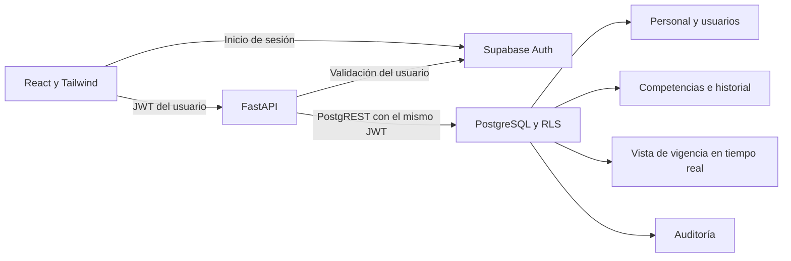

# Análisis de arquitectura y alcance de la primera fase

Se implementó el MVP descrito en la sección 3 del documento de referencia: modelo de datos, autenticación por roles, alta y consulta del estado de fuerza, registro de competencias básicas, cálculo de vigencia y panel de alertas. Se agregaron edición y baja lógica porque la sección 10.2 las incluye en la gestión del personal.

El documento se trató como especificación de producto. Sus ejemplos de código y recomendaciones se revisaron antes de trasladarlos al sistema; las recomendaciones de validación previa con DGSDP no se interpretaron como una orden para detener el desarrollo.

## Correspondencia con el documento

| Requisito | Implementación de fase 1 |
|---|---|
| React + Tailwind + Vite | Interfaz React 18 con TypeScript; directorio, expediente, formularios y panel de vigencia |
| Python / FastAPI | API con esquemas Pydantic, control de roles y OpenAPI |
| Supabase Auth y PostgreSQL | Inicio de sesión, JWT validado contra Auth, rol leído de una tabla protegida y RLS |
| CUIP o CURP | CUIP preferente; CURP obligatoria cuando no hay CUIP; unicidad independiente y normalización |
| Historial de competencias | Inserciones transaccionales con bloqueo por persona y un índice único parcial para el registro activo |
| Vigencia de tres años | Trigger PostgreSQL y regla Python equivalentes, incluidos años bisiestos |
| Alertas a 90 días | Vista con evaluación en tiempo real; umbral almacenado en `configuracion` |
| Panel propio del trabajador | Expediente y evaluaciones solo de la persona vinculada a la cuenta |
| Catálogos independientes | Corporaciones, cargos y grados; sin catálogo oficial inventado |

## Arquitectura implementada

El adaptador de demostración es independiente y solo se habilita explícitamente en desarrollo local. No sustituye Supabase ni proporciona seguridad de producción. No hay datos personales reales en la semilla.

## Correcciones respecto de los ejemplos

1. **29 de febrero.** `date.replace(year=year+3)` falla para una fecha bisiesta cuyo destino no es bisiesto. La implementación limita el día al último día del mes, de acuerdo con PostgreSQL: 29/02/2024 → 28/02/2027.
2. **RLS.** El ejemplo usa `usuario_auth_id`, inexistente en el diccionario. Se utiliza `usuarios.personal_id` y se verifica `usuarios.activo`. El rol no proviene de metadatos modificables por el usuario.
3. **Vistas.** La vista utiliza `security_invoker=true` para respetar las políticas de las tablas consultadas.
4. **Renovaciones simultáneas.** El diccionario no impide dos registros activos. Una función transaccional bloquea la fila de personal y el índice parcial refuerza la unicidad.
5. **Personal sin evaluación.** La vista original usa un JOIN que lo excluye. Se usa LEFT JOIN para mostrar “Sin registro”.
6. **No aprobado.** Un resultado no aprobado no genera fecha de vencimiento ni aparece como vigente. Se presenta como pendiente de seguimiento.
7. **Cron.** El ejemplo de upsert no define una clave para evitar alertas duplicadas. En fase 1 no se almacenan alertas duplicadas: el panel se deriva de la vista. El registro persistente de notificaciones y su deduplicación quedan para la fase 3.
8. **Modelo gráfico.** Algunas líneas del diagrama simplificado no coinciden con las llaves foráneas del diccionario. La fase 1 utiliza las relaciones explícitas del diccionario; cursos y sesiones se incorporarán con una migración posterior.
9. **Roles.** Se unifican los valores internos como `admin`, `capacitacion` y `trabajador`. La interfaz muestra sus nombres completos en español.
10. **Rutas.** Se usa UUID en `/api/personal/{id}` para evitar ambigüedad entre CUIP y CURP. La búsqueda de identificadores se hace mediante `/api/personal?q=...`.

## Decisiones que deben validarse con el área usuaria

- El vencimiento se considera al finalizar el día indicado: si vence hoy, todavía aparece “Por vencer”; al día siguiente aparece “Vencida”.
- El umbral inicial es 90 días naturales y se puede cambiar de 0 a 365 en `configuracion`.
- La fecha de negocio usa `America/Mexico_City` tanto en Python como en SQL.
- La evaluación de fecha más reciente determina el estado actual. Una evaluación antigua se agrega al histórico; si dos evaluaciones tienen igual fecha, la última capturada queda activa.
- Una nueva evaluación no aprobada reemplaza el estado de la anterior y muestra “No aprobado”. La política institucional de reprobación y conservación de acreditaciones previas debe confirmarse.
- La validación de CUIP se limita a caracteres alfanuméricos y al máximo de 20 caracteres del documento; falta una especificación institucional de longitud/patrón exactos.
- La CURP se valida por estructura, no contra RENAPO ni con verificación de existencia o dígito oficial.
- La corporación y adscripción son obligatorias. Cargo, grado y sexo son opcionales. Los catálogos reales deben proporcionarse; la migración no inventa valores oficiales.
- Las cuentas y los catálogos se administran inicialmente desde Supabase. No se incluye una pantalla de administración de usuarios en este MVP.

## Fases posteriores

Fase 2: modelos de cursos, sesiones, inscripciones, formación inicial, certificaciones generales, archivos y bitácora; interfaz del calendario, cargas con previsualización y trazabilidad. Incorporar almacenamiento privado y URLs firmadas al habilitar documentos.

Fase 3: indicadores gráficos, reportes, notificaciones y procesos programados. El cron deberá autenticar al invocador, resolver alertas tras recertificación y evitar duplicados. No se configuró un horario UTC a partir del ejemplo “07:00” porque requiere confirmar la zona horaria y el horario de negocio.

## Referencias técnicas verificadas

- [Supabase: Row Level Security](https://supabase.com/docs/guides/database/postgres/row-level-security), en particular vistas con `security_invoker` y permisos mínimos.
- [Supabase: getUser](https://supabase.com/docs/reference/javascript/auth-getuser), validación del usuario contra el servicio Auth.
- [Vercel: FastAPI](https://vercel.com/docs/frameworks/backend/fastapi), detección del punto de entrada de la API. Los límites del plan deben verificarse al desplegar; no se copiaron los límites temporales del documento como constantes.

No se pudo renderizar el DOCX con el motor empaquetado porque no incluye LibreOffice en este entorno. Se extrajo todo el texto y se inspeccionaron directamente las dos imágenes de arquitectura y relaciones. No se modificó el documento original.
